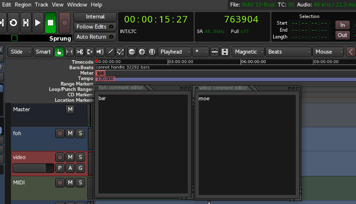

# Cue Caller 

A lua script to use Ardour for change comments on multiple tracks following playhead position.

## Use Case

Some live concerts use timecode to sync events (video, lights, fireworks, audio scenes, etc) Ardour can sync to timecode and the script can sync alert messages for humans involved.

Some examples:

* FOH audio operator can have alerts on solo instruments,  mute sections, global settings of a song (key, tempo, etc), effects related to lyrics
* Video Operator can lead cameras to solos
* Light Operatos can lead follow spots, be aware of special momments
* Telepronter can sync lyrics and alerts to timecode
* Choreographer can lead dancers

## TODO:
  * Find a data structure to read-write from lua safe to edit comments without touch the script.
  * Find a convenient way to increase font size of comments box (can be done recompiling Ardour or changing de global font size)
  * Find a way to brodcast track comments 
    * Browser ?
    * ChatBot? Messenger ?
    * Android app in a local network ?

